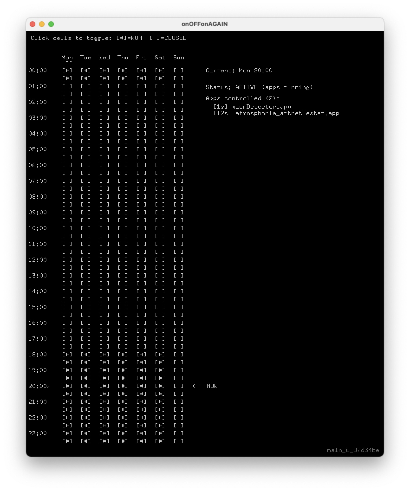

# onOFFonAGAIN

A macOS app that runs other applications on a weekly schedule. You define when each day is “on” (apps run) or “off” (apps quit). Good for kiosks, displays, and installations that should only run at certain times.

## What it's good for

- **Scheduled displays and kiosks** — Run show or demo apps only during opening hours; turn them off at night or on closed days.
- **Time-based “darkness”** — Define half-hour slots per day when controlled apps are closed (e.g. no content after hours).
- **Art installations and exhibits** — Automate when viewer-facing apps start and stop without manual intervention.
- **Multi-app control** — Launch and quit several apps from a list, with optional staggered delays so they don’t all start at once.
- **Weekly patterns** — Different schedules per weekday (e.g. weekdays 9–18, weekends 10–16, or custom patterns).

You edit the schedule in a 7-day × 48 half-hour grid (click/drag), and the app launches or quits the apps listed in `appsToControl.txt` according to the current time and saved `schedule.json`.

## Requirements

- macOS
- [openFrameworks](https://openframeworks.cc/) (this project is built with oF)

## Configuration

- **`bin/data/appsToControl.txt`** — List of apps to start/stop. Format: `delay_seconds, /path/to/App.app`. Delay is used for staggered launch.
- **`bin/data/schedule.json`** — Weekly schedule (generated and saved by the app; 7 days × 48 half-hour slots).

## Build

Use the openFrameworks project generator or build from the project’s Makefile/Xcode config in the usual way for your oF setup.

## Note

This project was developed with AI assistance.
